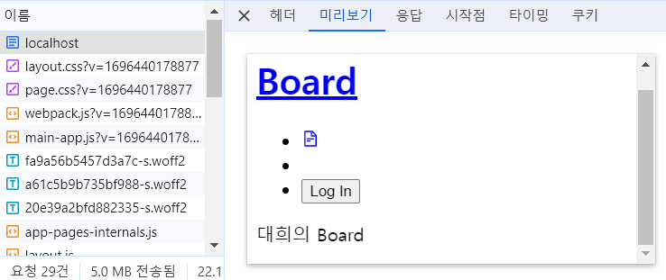

# 개요
나만의 게시판으로
반응형 웹으로 화면의 크기에 따라 적절하게 보여주도록 구현하였다. 
 

 

# 사용기술
### 언어
* TypeScript
### 주요 기술
* React, Next.js 13, SWR, Tailwind CSS, Context
 

# 설명

## 1. 구현 내용

### 1-1 로그인
로그인은 NextAuth.js로 구현 
해당 기능은 좋은 블로그 자료가 있어서 참고하였다. 
 

 
(참고 블로그 : https://velog.io/@uni/NextAuth.js-%EA%B5%AC%EA%B8%80-%EB%A1%9C%EA%B7%B8%EC%9D%B8-Next%EB%B2%84%EC%A0%84-13.4.2)

### 1-2 Next.js 13
Next.js 13 최신 버전부터는 app 폴더 안에 폴더만 생성해주면 돼서 라우팅하기 편한 장점이 있다.
 

 
 
Next.js는 화면에 처음 접속할 때, Client 컴포넌트도 정적인 부분은 최대한 서버에서 미리 만들어서 보내주는 장점이 있다. 기존 React만 사용했을 때는 빈 HTML을 Client에 가져와서 화면을 만들어줬는데, Next.js를 사용하면 정적인 부분은 미리 만들어 Client로 보내줘서 화면이 복잡할 수록 성능 차이가 날 것으로 생각된다.
 

### 1-3 Tailwind CSS
CSS로 Tailwind를 이용했는데, 반응형 웹을 구현하는데 코드가 간결한다는 장점이 있다.  
그리고 주니어에게 기존 소스로 어떻게 구현해야 하는지 확인할 수 있는 장점도 있다.
 

### 1-4 SWR
네트워크 상태 관리로 주로 React-Query를 사용하는데, SWR은 Next.js를 만든 vercel에서 만들었기에 사용했다. 
 

### 1-5 Portal
Modal은 React Portal로 구현다.  
해당 기능도 좋은 자료가 있어 참고하였다.
 

 
(참고 블로그 : https://jeonghwan-kim.github.io/2022/06/02/react-portal)
 

## 2. 개발하면서 흥미로웠던 점

### 2-1. 북마크 등록할 때, 화면에 적용하는데 10초 넘게 걸림
#### 증상
* 북마크를 등록해서 화면에 나타는데 10초 이상 걸림

 

#### 원인
* SWR은 데이터를 가져올 때, 아래와 같은 방식으로 동작하는데,
  1) 기존 캐시에 들어있는 데이터 조회
  2) 캐시된 데이터에 변경이 있으면 서버에 재요청 
  2번 째 과정에서 시간이 오래 걸렸었음

#### 해결
* mutate는 데이터를 언제 최신화 할지 도와주는 역할을 하는데,  
optimisticData 옵션으로 UI에 데이터를 즉시 반영하고  
나중에 서버에서 재요청된 데이터를 반영하도록 함

 

